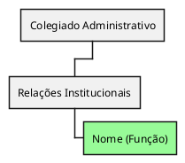

# AI Guide — Como usar IA para criar e manter funcionalidades do CosmoWare

> **Objetivo**: tornar o CosmoWare um projeto **IA-friendly** de ponta a ponta.  
> Este guia mostra como **planejar, gerar, revisar e manter** funcionalidades inteiras **usando IA**, a partir do `REPOMIX.md`.

---

## 1) Estratégia recomendada de uso do RepoMix

### 🔹 Estratégia Híbrida (recomendada)
- Sempre inicie colando o **`REPOMIX.md` atualizado** no chat da IA (ou forneça o link, se o modelo suportar).  
- Depois acrescente um **Brief estruturado** da funcionalidade desejada (veja abaixo).  
- Se o `REPOMIX.md` for muito grande para o modelo:
  - Use apenas os trechos mais relevantes (ex.: `core/utils.js`, `domains/<domínio>/main.js`, exemplos próximos ao que você quer implementar).  
  - Sempre acrescente o Brief.  

Assim a IA entende o **contexto global** (arquitetura e convenções) e também o **objetivo específico** (Brief).

### Outras opções
- **Importar só o REPOMIX.md**: funciona bem em modelos com grande contexto.  
- **Importar só trechos específicos**: útil em prompts rápidos ou para modelos com limite menor, mas pode gerar inconsistências.  

---

## 2) Workflow IA-first

1. **Obtenha contexto**  
   - Gere o `REPOMIX.md` local (`npx repomix`) ou use o do repositório (atualizado pelo CI).  
   - Cole o conteúdo no chat da IA.  

2. **Escreva o Brief da funcionalidade** (template abaixo).  

3. **Use o Prompt Base de Geração de Módulo**.  

4. **Teste manualmente** a extensão.  

5. **Itere com a IA** usando prompts de refino/depuração.  

6. **Abra PR** com checklist preenchido e, se possível, o prompt utilizado.  

---

## 3) Template de Brief

```
# Brief de funcionalidade (CosmoWare / IA)

## Domínio e Tela
- Domínio: icnet.conscienciologia.org.br
- Breadcrumb (não normalizado): Pessoa Física » Voluntário
- URL(s) típica(s): https://icnet.conscienciologia.org.br/main.aspx#

## Objetivo
Ex.: Extrair tabela de voluntários e gerar WBS PlantUML via Kroki com toolbar (Gerar Imagem / Formato / Baixar).

## Entradas da página (amostra real de HTML)
Cole trechos relevantes:
- Breadcrumb (#TbPathAndNavigation #lbPath)
- Tabela (#Grid1)
- Exemplo de linhas relevantes

## Resultado Esperado
- Toolbar discreta antes da tabela com botões: Gerar Imagem, Formato (PNG|SVG), Baixar
- Geração de imagem e link de download
- Nome do arquivo: <IC>-voluntarios-<timestamp>.png|svg

## Critérios de Aceitação
- Só atua quando breadcrumb = “Pessoa Física » Voluntário”
- Não duplica UI (idempotência)
- Logs com prefixo [ICNET/PF-VOL]
- Erros tratados no console de forma clara
- Compatível com iframes

## Observações
- Usar ctx.utils (nsLogger, normalizeText, readBreadcrumb, attachSimpleObserver, krokiPlantUmlToPng, krokiPlantUmlToSvg, timeStampCompact)
- IDs/Classes com prefixo cosmoware-
```

---

## 4) Prompt Base — Geração de Módulo

```
Você é um assistente desenvolvedor do projeto CosmoWare. 
Considere **todo o contexto em REPOMIX.md** e o seguinte **Brief** (abaixo). 
Gere um **módulo ES Module** que exporte `export async function init(ctx) { ... }`, 
e siga estes requisitos:

- Estrutura: domains/<subdomínio>/<rota>/<nome>.js
- Independente (não importa outra feature)
- Use apenas ctx.utils (nsLogger, normalizeText, readBreadcrumb, attachSimpleObserver, krokiPlantUmlToPng, krokiPlantUmlToSvg, timeStampCompact)
- Valide breadcrumb antes de atuar
- Idempotência (não duplicar UI)
- Logs com namespace fixo (ex.: [ICNET/ORG])
- IDs/classes com prefixo cosmoware-
- Comente trechos críticos (por que do observer, throttling, etc.)
```

---

## 5) Prompt Base — Registro no Router

```
Gere o snippet para registrar a rota no arquivo domains/<subdomínio>/main.js,
seguindo o padrão do projeto:

- `name`: caminho legível da tela
- `match(ctx)`: verificação do breadcrumb (use normalizeText só para comparar)
- `loader()`: import dinâmico via chrome.runtime.getURL

Além do snippet, diga onde colar e gere checklist de testes manuais.  
Breadcrumb alvo: "Pessoa Física » Voluntário".
```

---

## 6) **Erros comuns e como evitar** (lições aprendidas)

### 6.1 nsLogger — API correta
- **Certo**:  
  ```js
  const { log, warn, error } = nsLogger("[ICNET/PF-VOL]");
  log("mensagem");
  ```
- **Errado**: tratar o retorno como função única (`ns("...")`).  
- Sempre padronize o namespace entre colchetes, ex.: `[ICNET/PF-VOL]`.

### 6.2 normalizeText — quando usar
- Use **somente** para **comparações** (ex.: breadcrumb).  
- **Nunca** normalize textos de **exibição** (nomes, rótulos) — preserve capitalização original.  
- Garanta que a entrada de `normalizeText` seja **string**.

### 6.3 readBreadcrumb — alvo exato
- Compare com a **string normalizada exata** do alvo.  
  ```js
  const alvo = normalizeText("Pessoa Física » Voluntário");
  const ok = readBreadcrumb(document).norm === alvo;
  ```

### 6.4 attachSimpleObserver — assinatura e loops
- Assinatura: `attachSimpleObserver(callback, nodeOuDocument)`.  
- **Evite loops**: o observer não deve disparar **geraçōes caras** (ex.: chamar Kroki) automaticamente.  
  - Preferir: marcar “sujo” ou **não gerar nada** — gerar **apenas** com ação explícita do usuário (botão).

### 6.5 Idempotência de UI
- Antes de inserir toolbar/preview, **verifique** por `#cosmoware-...`.  
- Nunca re-anexar listeners se o elemento já existe.

### 6.6 PlantUML WBS — estilo e estereótipos
- **Estilo correto** (WBS usa classes dentro de `wbsDiagram`):
  ```plantuml
  <style>
  wbsDiagram {
    .ativo   { BackgroundColor PaleGreen }
    .inativo { BackgroundColor LightGray }
  }
  </style>
  ```
- Use estereótipo nos nós: `<<ativo>>` / `<<inativo>>`.  
- **Não** use `.stereotype("...")` no WBS.

### 6.7 Raiz condicional “Voluntários”
- Se houver **apenas um** nível raiz (ex.: “Colegiado Administrativo”), **omite** “Voluntários” e use esse nível como `*`.  
- Se houver **mais de um** topo, inclua “* Voluntários”.

### 6.8 Capitalização
- Preserve os textos do DOM como vieram para labels do diagrama.  
- Para ordenar, você pode usar `localeCompare`, mas **não** altere o case exibido.

### 6.9 Geração sob demanda (UX)
- **Não** gere a imagem ao carregar a página nem ao detectar mutações.  
- Use **um botão único**: “🖼️ Gerar Imagem”.  
- Depois de gerar, habilite “Baixar imagem”.

### 6.10 Persistência de preferências (localStorage)
- Chave **versionada**: `cosmoware_pfvol_prefs_v1`.  
- Estrutura mínima: `{ fmt: "png" | "svg" }`.  
- Mescle com defaults ao carregar (`{ ...base, ...parsed }`).

### 6.11 Funções utilitárias — existência e fallback
- Antes de usar um util, verifique se existe:
  ```js
  if (typeof krokiPlantUmlToSvg === "function") { ... } else { /* fallback */ }
  ```
- SVG indisponível → **fallback para PNG**, com `warn`.

### 6.12 Download e preview
- Habilite download **após** gerar: defina `href` e `download`.  
- Trate `Blob`, `ArrayBuffer` e **data URI**.  
- Se recriar URLs, considere `URL.revokeObjectURL` do anterior.

### 6.13 Segurança e privacidade
- Não logue dados pessoais sensíveis.  
- Os diagramas enviados ao Kroki devem conter **apenas** o texto necessário.

---

## 7) Snippet de toolbar (alinhado à esquerda)

```js
// Layout: [🖼️ Gerar Imagem] [Formato: (PNG|SVG)] [Baixar imagem] [status]
const toolbar = document.createElement("div");
toolbar.id = "cosmoware-pf-vol-toolbar";
toolbar.className = "cosmoware-toolbar";
Object.assign(toolbar.style, {
  display: "flex",
  gap: "10px",
  alignItems: "center",
  justifyContent: "flex-start",
  flexWrap: "wrap",
  margin: "8px 0",
  padding: "6px 8px",
  border: "1px solid #ddd",
  borderRadius: "6px",
  background: "#fafafa",
  fontSize: "12px",
});
```

- **Botão “Gerar Imagem”** dispara toda a cadeia (coleta → WBS → Kroki → preview → download).  
- **Select Formato** persiste em `localStorage`.  
- **“Baixar imagem”** inicia **desabilitado** e só é habilitado após a geração.

---

## 8) Exemplo de WBS correto (com raiz condicional)



> Observação: se houver mais de um nível topo, use:
>
> ```
> * Voluntários
> ** Colegiado Administrativo
> ** Outro Topo
> ...
> ```

---

## 9) Checklist de Aceitação

- [ ] Atua somente na tela correta (breadcrumb igual ao alvo)  
- [ ] Não duplica UI (idempotência)  
- [ ] Logs claros e padronizados `[ICNET/... ]`  
- [ ] Usa apenas `ctx.utils`  
- [ ] Compatível com iframes  
- [ ] Arquivo em `domains/<domínio>/<rota>/<feature>.js`  
- [ ] Rota registrada em `domains/<domínio>/main.js`  
- [ ] Geração **apenas** via botão “Gerar Imagem”  
- [ ] Formato (PNG/SVG) **persistente** via `localStorage`  
- [ ] WBS com **estilo correto** e **estereótipos**  
- [ ] Raiz “Voluntários” **condicional**  
- [ ] Testado manualmente (preview + download)  
- [ ] Prompt usado documentado no PR  

---

## 10) Dicas de HTML no Prompt

- Copie trechos reais do DOM (breadcrumb, tabela, botões).  
- Inclua variações (linhas pares/ímpares).  
- Informe se há iframes.  

---

## 11) Prompts auxiliares

**Refatorar para padrão CosmoWare**
```
Reescreva este módulo para o padrão CosmoWare:
- exporta init(ctx)
- usa apenas ctx.utils
- logs com nsLogger
- idempotência
- comentários críticos
[cole código aqui]
```

**Gerar descrição de PR**
```
Gere descrição de PR no padrão CosmoWare:
- O que foi feito
- Prints
- Logs esperados
- Checklist
```
**Changelog curto**
```
Gere changelog curto no formato semântico (feat, fix, chore).
```

---

## 12) Segurança

- Nunca logar dados pessoais sensíveis  
- Usar Kroki apenas para texto de diagrama  
- Se houver dados sensíveis → mascarar/remover e documentar no PR  

---

## 13) Exemplos no Repositório

- `domains/icnet/pessoa-fisica/voluntario/organograma-voluntarios.js`  
- `domains/icnet/main.js`  
- `core/utils.js`  

> Estes arquivos estão sempre no `REPOMIX.md` e servem como exemplos.
