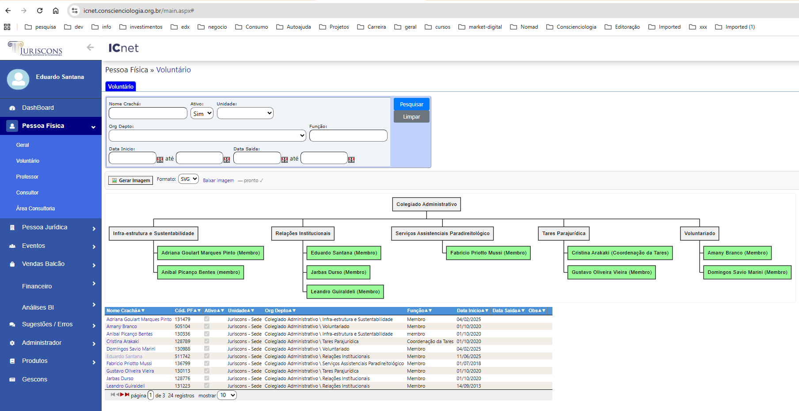

# CosmoWare

**CosmoWare** é uma extensão de navegador para **reduzir o assédio digital** no uso dos sistemas da Conscienciologia (`*.conscienciologia.org.br`).  
Ela adiciona melhorias simples e úteis em telas específicas, sem alterar o funcionamento original dos sistemas.

📦 Contexto do repositório para IA: veja **[REPOMIX.md](./REPOMIX.md)**

---

## ✨ Propósito

Apoiar o voluntário na **autogestão lúcida**, tornando o uso dos sistemas mais **claro, leve e produtivo**.  
Cada funcionalidade busca diminuir atritos, automatizar tarefas repetitivas e promover mais **cosmoética digital**.

---

## 🚀 Funcionalidades

### ICNet — Pessoa Física » Voluntário — **WBS do Voluntariado**
Gera um **diagrama WBS (Work Breakdown Structure)** em imagem a partir da tabela de voluntários.

- ✅ **Toolbar discreta** antes da tabela com:
  - **🖼️ Gerar Imagem** (único gatilho de geração)
  - **Formato: PNG / SVG** (persistente via `localStorage`)
  - **Baixar imagem** (habilitado após a geração)

---

### ICNet — Configuração IC » Organograma (clássico)
Gera automaticamente um organograma a partir dos dados da tela administrativa, com **download de PNG** nomeado com IC e data/hora.  

---

## 🔧 Instalação (modo desenvolvedor)

1. Baixe o [código fonte zip](https://github.com/conscienciologia/CosmoWare/releases/latest/) 
2. No Chrome/Brave, abra: `chrome://extensions`
3. Ative **Developer mode / Modo desenvolvedor**
4. Clique em **Load unpacked / Carregar sem empacotar**
5. Selecione a pasta do projeto

Pronto ✅ A extensão será carregada e atuará **somente nas telas suportadas**.

---

## 🖥️ Como usar (Pessoa Física » Voluntário)

1. Abra a tela **Pessoa Física » Voluntário** no ICNet.  
2. Na toolbar inserida pela extensão, clique em **🖼️ Gerar Imagem**.  
3. (Opcional) Escolha o **formato** (PNG/SVG). O formato escolhido é **lembrado** entre páginas.  
4. Após a renderização, use **Baixar imagem** para salvar o arquivo.  

> Nas telas não reconhecidas, a extensão **não interfere**.

---

## 🩺 Solução de problemas

- **Botões não aparecem**: confirme se o breadcrumb é exatamente **Pessoa Física » Voluntário**.  
- **Sem preview/erro de rede**: verifique conexão com `https://kroki.io/` (bloqueadores podem impedir).  
- **SVG não baixa**: assegure que o navegador permita baixar **Blob URLs**; tente PNG como alternativa.  
- **Dados diferentes após paginação**: esta feature só gera a imagem quando você clicar em **Gerar Imagem** (não gera automaticamente).

---

## 🔒 Privacidade

- Lemos apenas o conteúdo da **página atual**, sem capturar dados pessoais para fora do navegador.  
- Para renderizar diagramas, usamos **Kroki.io**: enviamos **apenas o texto do PlantUML** necessário.  
- Detalhes em [`SECURITY.md`](./SECURITY.md).  

---

## 🤝 Como contribuir

CosmoWare é **aberto a contribuições humanas e via IA**.  

- Sugira novas features: abra uma [issue](./.github/ISSUE_TEMPLATE/feature_request.md)  
- Contribua com código: veja [`CONTRIBUTING.md`](./CONTRIBUTING.md)  
- Entenda a arquitetura: [`ARCHITECTURE.md`](./ARCHITECTURE.md)  
- Guia de dev: [`DEVELOPMENT.md`](./DEVELOPMENT.md)  
- Uso de IA no projeto: [`AI_GUIDE.md`](./AI_GUIDE.md)  

---

## 📜 Licença & Conduta

- Projeto comunitário e aberto  
- Siga o [`CODE_OF_CONDUCT.md`](./CODE_OF_CONDUCT.md) para manter um ambiente **cosmoético e acolhedor**  

---

> ✨ **CosmoWare = Cosmoética + Software** ✨  
Promovendo lucidez, organização e leveza no uso da tecnologia.
