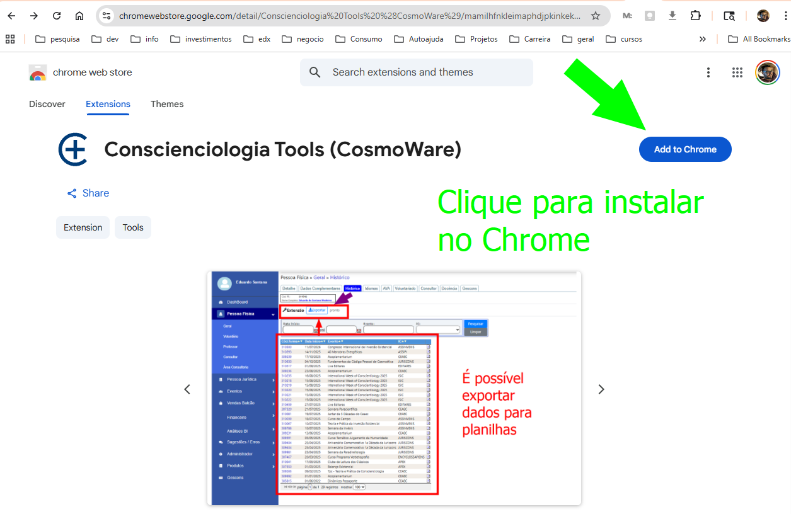
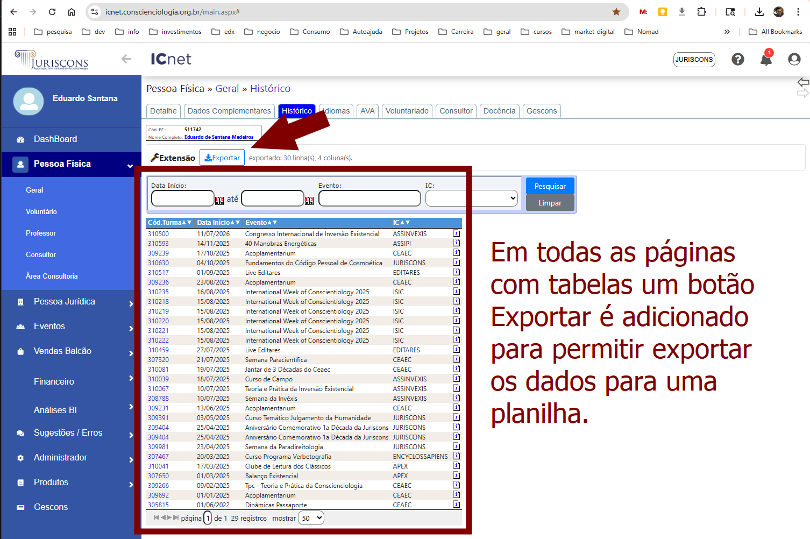

# CosmoWare

**CosmoWare** é uma extensão de navegador para **reduzir o assédio digital** no uso dos sistemas da Conscienciologia (`icnet.conscienciologia.org.br`).  
Ela adiciona melhorias simples e úteis em telas específicas, sem alterar o funcionamento original dos sistemas.

📦 Contexto do repositório para IA: veja **[REPOMIX.md](./REPOMIX.md)**

---

## ✨ Propósito

Apoiar o voluntário na **autogestão lúcida**, tornando o uso dos sistemas mais **claro, leve e produtivo**.  
Cada funcionalidade busca diminuir atritos, automatizar tarefas repetitivas e promover mais **cosmoética digital**.

## 🔧 Instalação (modo usuário)

Acesse a [páginda da extensão na loja do Chrome](https://chromewebstore.google.com/detail/mamilhfnkleimaphdjpkinkekdbkbacl?utm_source=item-github-readme)

Clique em Adicionar no Crome, conforme a figura acima.

TIP: caso seja um desenvolvedor veja a Instalação (modo desenvolvedor) mais abaixo.

---

## 🚀 Funcionalidades

### ICNet — Pessoa Física » Voluntário — **WBS do Voluntariado**

Gera automaticamente organograma contendo os voluntários da instituição a partir dos dados da tela administrativa.

1. Abra a tela **Pessoa Física » Voluntário** no ICNet.
2. Na toolbar inserida pela extensão, clique em **🖼️ Gerar Imagem**.
3. (Opcional) Escolha o **formato** (PNG/SVG). O formato escolhido é **lembrado** entre páginas.
4. Após a renderização, use **Baixar imagem** para salvar o arquivo.

---

### ICNet — Configuração IC » Organograma (clássico)

Gera automaticamente um organograma a partir dos dados da tela administrativa, com **download de PNG** nomeado com IC e data/hora.

---

## ICNet — Exportar tabelas (qualquer página)

A extensão adiciona um botão para exportar os dados de qualquer tabela. Em qualquer tela do ICNet com uma tabela, é possíve exportar os dados para uma planilha.

---

## 🩺 Solução de problemas

- **Botões não aparecem**: confirme se o breadcrumb é exatamente **Pessoa Física » Voluntário**.
- **Sem preview/erro de rede**: verifique conexão com `https://kroki.io/` (bloqueadores podem impedir).
- **SVG não baixa**: assegure que o navegador permita baixar **Blob URLs**; tente PNG como alternativa.
- **Dados diferentes após paginação**: esta feature só gera a imagem quando você clicar em **Gerar Imagem** (não gera automaticamente).

---

## 🔒 Privacidade

- Lemos apenas o conteúdo da **página atual**, sem capturar dados pessoais para fora do navegador.
- Para renderizar diagramas, usamos **Kroki.io**: enviamos **apenas o texto do PlantUML** necessário.
- Detalhes em [`SECURITY.md`](./SECURITY.md).

---

## 🔧 Instalação (modo desenvolvedor)

1. Baixe o [código fonte zip](https://github.com/conscienciologia/CosmoWare/releases/latest/)
2. No Chrome/Brave, abra: `chrome://extensions`
3. Ative **Developer mode / Modo desenvolvedor**
4. Clique em **Load unpacked / Carregar sem empacotar**
5. Selecione a pasta do projeto

Pronto ✅ A extensão será carregada e atuará **somente nas telas suportadas**.

---

## 🤝 Como contribuir

CosmoWare é **aberto a contribuições humanas e via IA**.

- Sugira novas features: abra uma [issue](./.github/ISSUE_TEMPLATE/feature_request.md)
- Contribua com código: veja [`CONTRIBUTING.md`](./CONTRIBUTING.md)
- Entenda a arquitetura: [`ARCHITECTURE.md`](./ARCHITECTURE.md)
- Guia de dev: [`DEVELOPMENT.md`](./DEVELOPMENT.md)
- Uso de IA no projeto: [`AI_GUIDE.md`](./AI_GUIDE.md)

---

## 📜 Licença & Conduta

- Projeto comunitário e aberto
- Siga o [`CODE_OF_CONDUCT.md`](./CODE_OF_CONDUCT.md) para manter um ambiente **cosmoético e acolhedor**

---

> ✨ **CosmoWare = Cosmoética + Software** ✨  
> Promovendo lucidez, organização e leveza no uso da tecnologia.

# Suporte

Está interessado na ferramenta? Acesse o [grupo do WhatsApp](https://chat.whatsapp.com/E27UQLdYsxFJs5PVHAWgkg?mode=ems_share_c).
